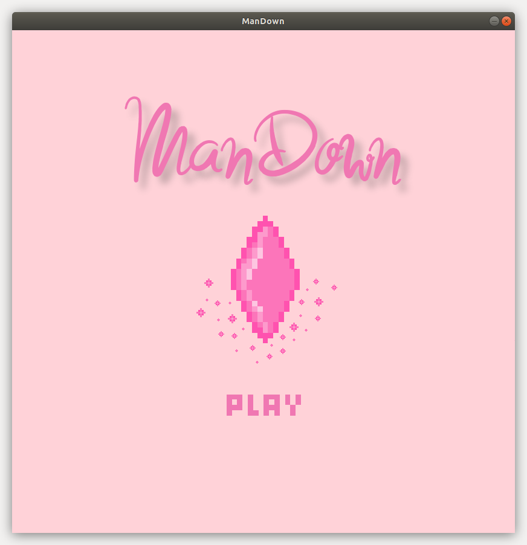
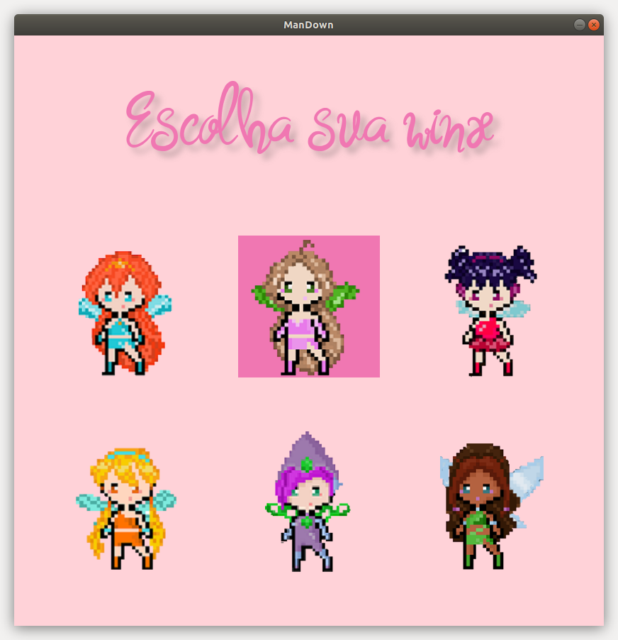
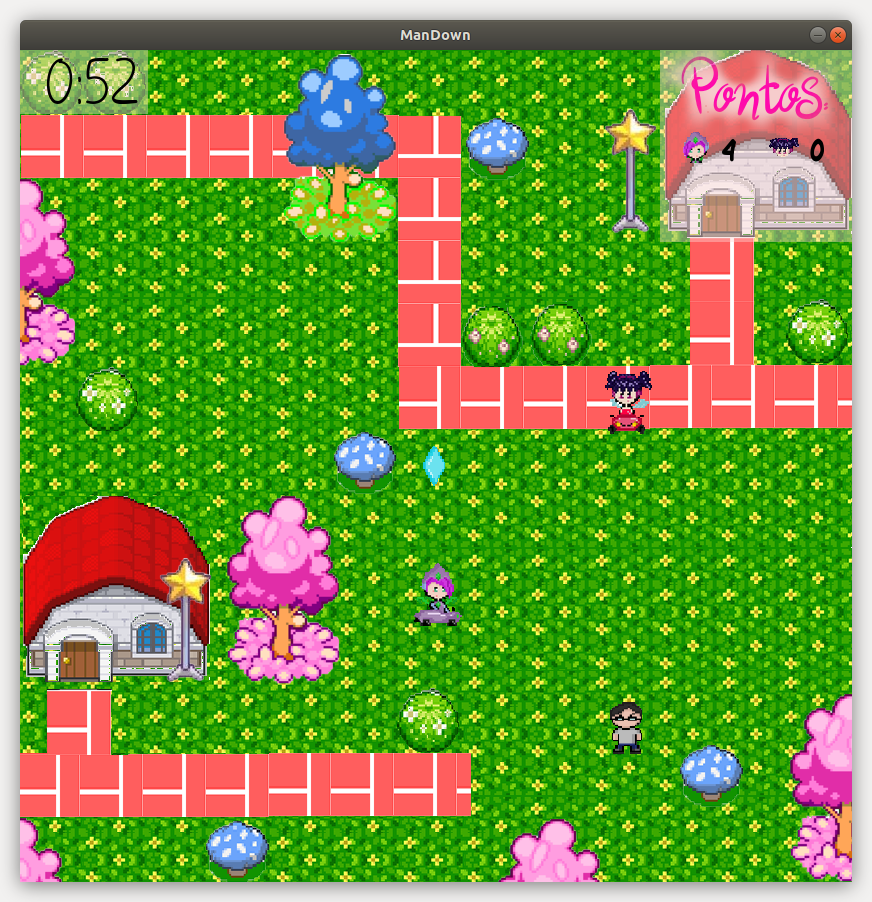

# ManDown-Final
Repositório do projeto da disciplina Introdução a Programação(if669).
[Documento explicando as coisas.](https://docs.google.com/document/d/1GUkAA6Tv_SgV5HuBIBtLkdRdiGoB3Gxj1L-__42aXpQ/edit) 

## Criado por
[ALICE OLIVEIRA DE QUEIROZ BRITO](https://github.com/aliceoq)
[ANA LETICIA ALBUQUERQUE SANTOS](https://github.com/aninhalbuquerque)
[DAYANE LIRA DA SILVA](https://github.com/deyenelira)
GABRIELA MARIA MELO DE SOUZA
MARIA LUIZA MENELAU DE ALBUQUERQUE ALMEIDA
[VICTORIA LUISI SOUZA CARNEIRO](https://github.com/vlsc)
sob a monitoria de [Jośe Carlos](https://github.com/kinhosz).  

## Screenshots

